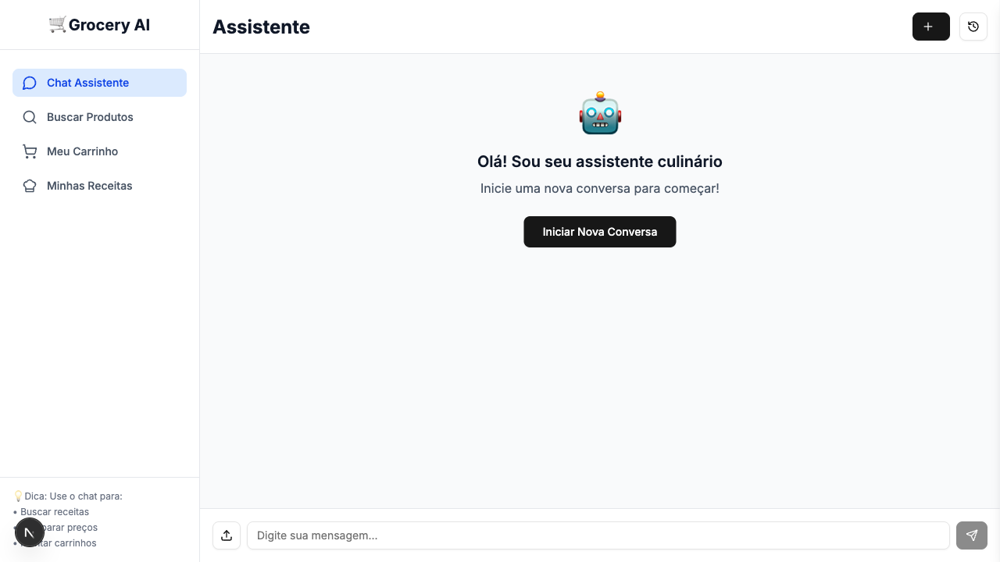
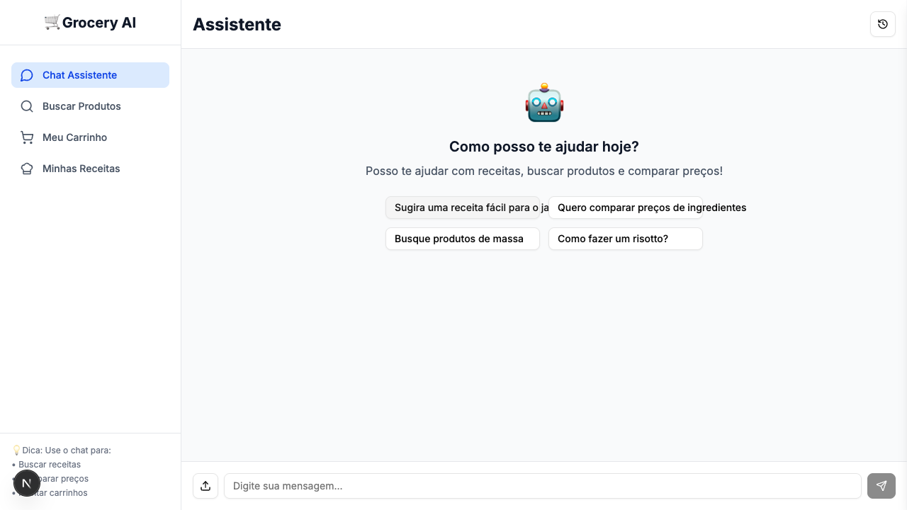
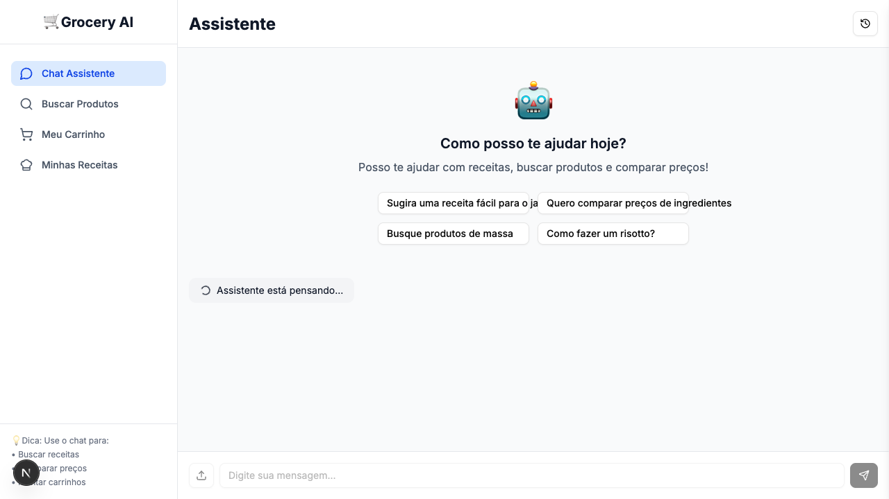
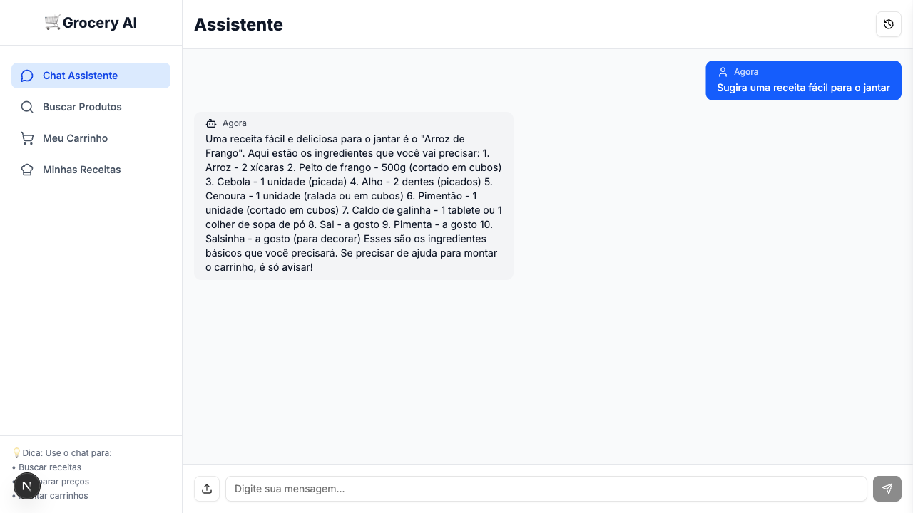

# 🤖 Smart Marketplace AI Study

Intelligent marketplace developed as a study project to explore AI integration with modern web technologies. Fullstack system with semantic search, product catalog, and intelligent recommendations.

## 🖼️ E2E Visual Flow (Chat)

Abaixo, um exemplo visual do fluxo de testes E2E do chat usando Playwright:

1. **Tela inicial do assistente**



2. **Iniciando uma nova conversa**



3. **Mensagem enviada pelo usuário**



4. **Resposta do assistente**

 

## 🏗️ Architecture

**Containerized Fullstack Application**
- **Backend**: REST API with NestJS + TypeScript
- **Frontend**: Modern interface with Next.js + TypeScript
- **Database**: PostgreSQL with pgvector extension for embeddings
- **Orchestration**: Docker Compose for development environment

## 🚀 Features

- **Product Catalog**: Product and store management
- **Semantic Search**: Integration with vector embeddings (pgvector)
- **REST API**: CRUD operation endpoints
- **Modern Interface**: Responsive UI with Tailwind CSS and Radix UI
- **Type Safety**: TypeScript across the entire stack

## 📋 Prerequisites

- Docker and Docker Compose
- Node.js 18+ (for local development)
- npm or yarn

## 🛠️ Installation and Setup

### 1. Clone the repository
```bash
git clone https://github.com/yourusername/smart-marketplace-ai-study.git
cd smart-marketplace-ai-study
```

### 2. Initialize the database
```bash
# Start PostgreSQL with pgvector
docker-compose up -d

# Import initial data (optional)
docker exec -i $(docker-compose ps -q db) psql -U postgres -d postgres < database/dump.sql
```

### 3. Run the Backend
```bash
cd backend
npm install
npm run start:dev
```

### 4. Run the Frontend
```bash
cd frontend
npm install
npm run dev
```

## 📁 Project Structure

```
smart-marketplace-ai-study/
├── backend/                    # NestJS API
│   ├── src/
│   │   ├── app.module.ts      # Main module
│   │   ├── catalog/           # Catalog module
│   │   │   ├── catalog.controller.ts
│   │   │   ├── catalog.service.ts
│   │   │   └── catalog.module.ts
│   │   ├── shared/            # Shared services
│   │   │   └── postgres.service.ts
│   │   └── main.ts            # Application bootstrap
│   ├── test/                  # E2E tests
│   └── package.json           # Backend dependencies
├── frontend/                   # Next.js interface
│   ├── src/
│   │   ├── app/               # Next.js App Router
│   │   │   ├── layout.tsx
│   │   │   └── page.tsx
│   │   ├── components/        # React components
│   │   │   └── ui/            # Base components (shadcn/ui)
│   │   └── lib/               # Utilities
│   └── package.json           # Frontend dependencies
├── database/
│   └── dump.sql               # Schema and initial data
├── docker-compose.yml         # Container orchestration
└── README.md                  # Documentation
```

## 🔧 Technology Stack

### Backend
- **NestJS**: Enterprise-grade Node.js framework
- **TypeScript**: Static typing
- **PostgreSQL**: Relational database
- **pgvector**: Extension for vectors/embeddings
- **Docker**: Containerization

### Frontend
- **Next.js 15**: React framework with App Router
- **TypeScript**: Static typing
- **Tailwind CSS**: Utility-first CSS framework
- **Radix UI**: Accessible components
- **Lucide React**: Icons

### DevOps & Tools
- **Docker Compose**: Local orchestration
- **ESLint**: Code linting
- **Prettier**: Code formatting
- **Jest**: Unit and E2E testing

## 🧠 Concepts Explored

### Artificial Intelligence
- **Vector Embeddings**: Numerical representation of data
- **Semantic Search**: Similarity-based search
- **pgvector**: Vector operations in PostgreSQL

### Modern Architecture
- **API First**: API-driven development
- **Microservices**: Separation of concerns
- **Containerization**: Isolation and portability
- **Type Safety**: Typing across the entire stack

## 🌐 API Endpoints

```
GET  /catalog/products    # List products
GET  /catalog/stores      # List stores
POST /catalog/search      # Semantic search
```

## 📊 Data Model

```sql
-- Stores
stores (id, name)

-- Products with embeddings
products (id, name, price, store_id, embedding)
```

## 🧪 Testing

```bash
# Backend - E2E Tests
cd backend
npm run test:e2e

# Frontend - Linting
cd frontend
npm run lint
```

## 📚 Learning Objectives

- AI integration with web applications
- Modern fullstack development
- Microservices architecture
- Vector operations in databases
- TypeScript best practices
- Containerization with Docker

## 🤝 Contributing

Study project - feel free to fork and experiment!

## 📄 License

This project is for educational purposes. 