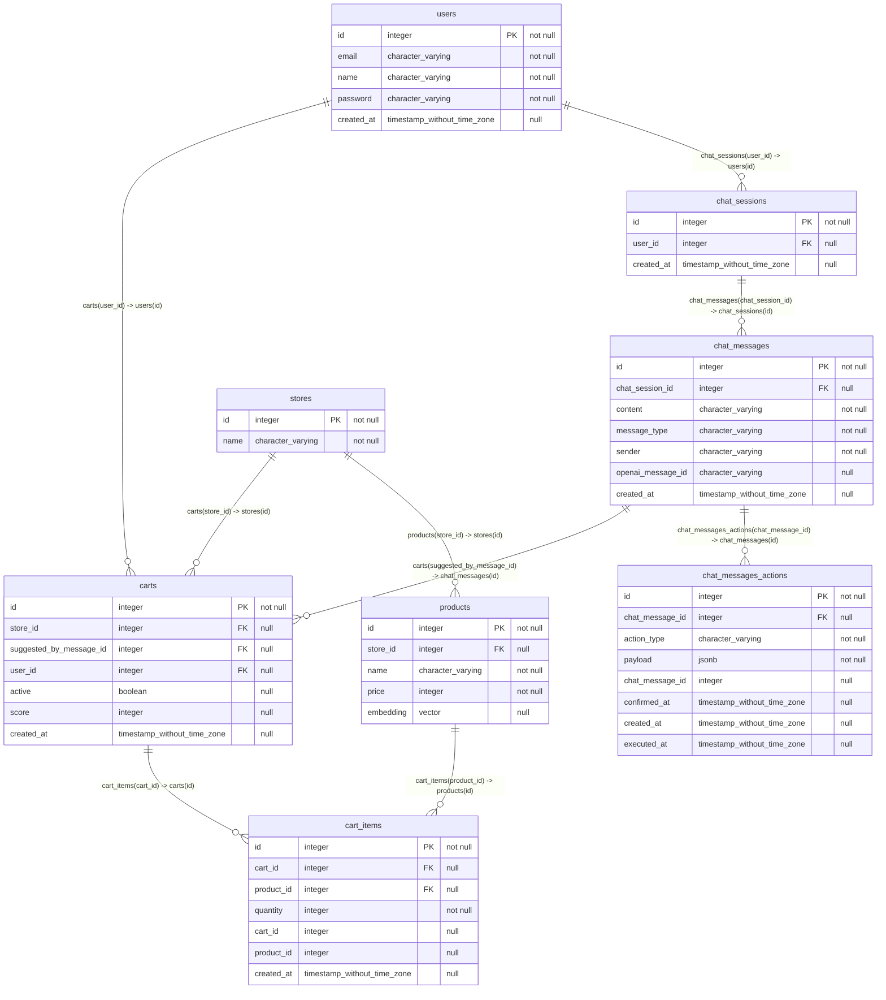

## Diagram

## Indexes

### `cart_items`

- `cart_items_pkey`
- `unique_cart_product`

### `carts`

- `carts_pkey`

### `chat_messages`

- `chat_messages_pkey`

### `chat_messages_actions`

- `chat_messages_actions_pkey`
- `unique_chat_message_action`

### `chat_sessions`

- `chat_sessions_pkey`

### `products`

- `products_pkey`

### `stores`

- `stores_pkey`

### `users`

- `users_email_unique`
- `users_pkey`
